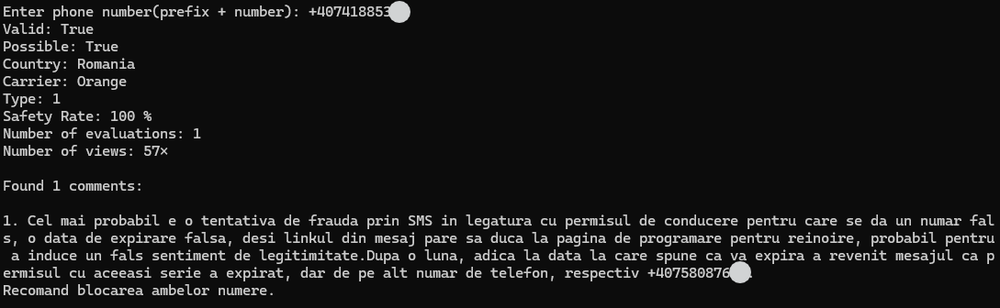

# PhoneSherlock

PhoneSherlock is a tool to quickly investigate a phone number.
- Checks the format, carrier, country and if the number is valid using 'phonenumbers'
- Extracts public data from 'listaabonatilor.ro' (safety rate, views, comments) using Playwright
- It works best for romanian numbers

## How to run

1. Download or clone the repository
2. 'pip install -r requirements.txt'
3. 'python -m playwright install'
4. 'python main.py'

